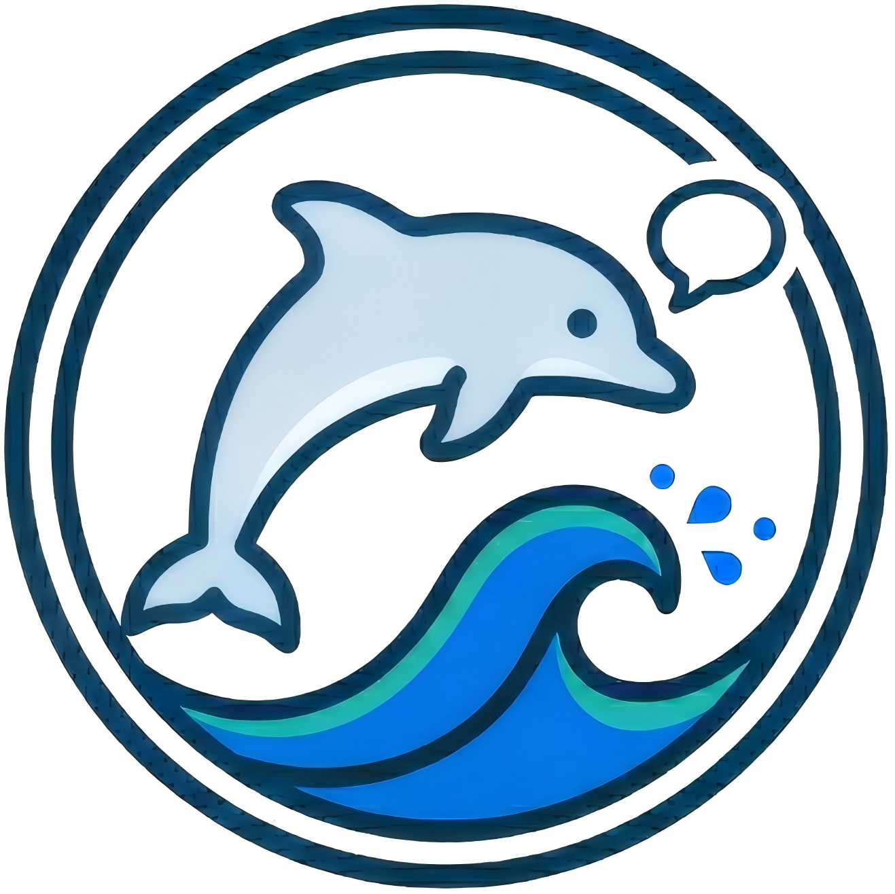
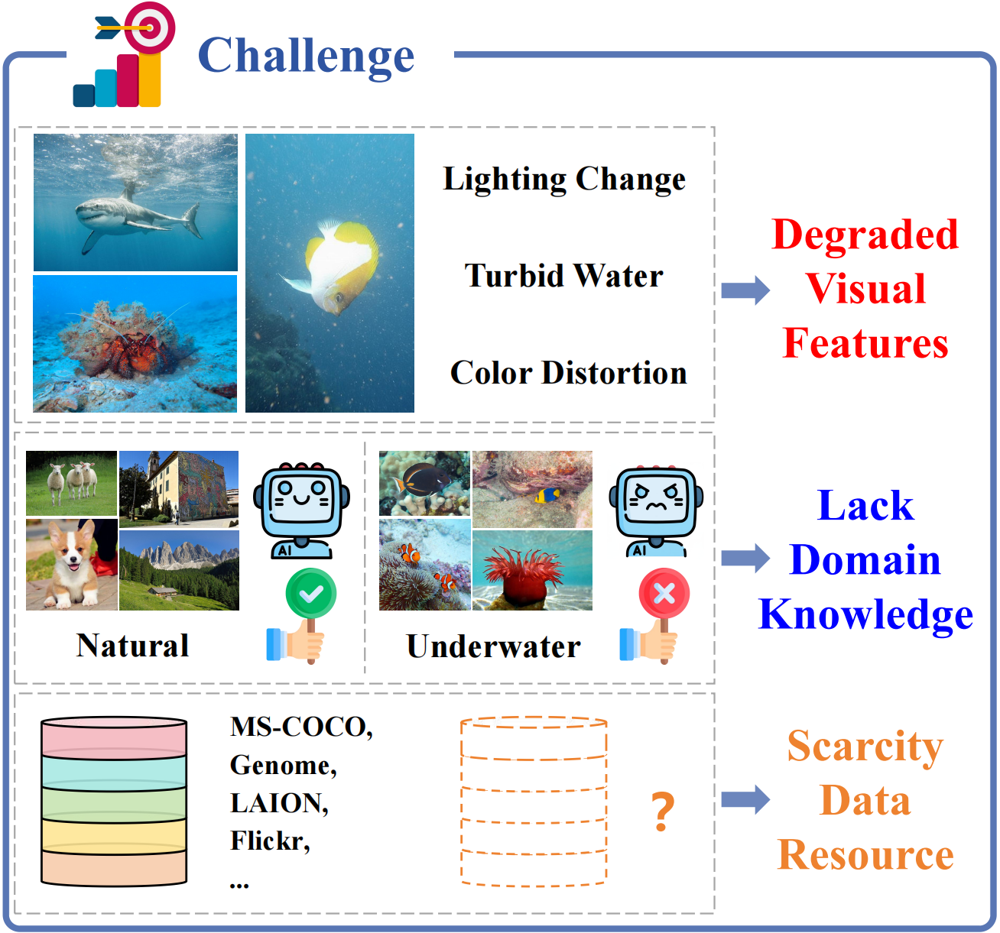
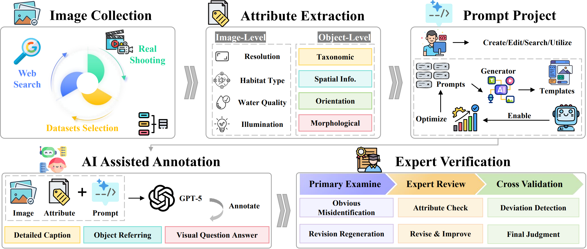
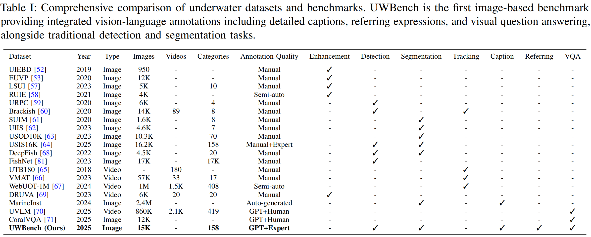
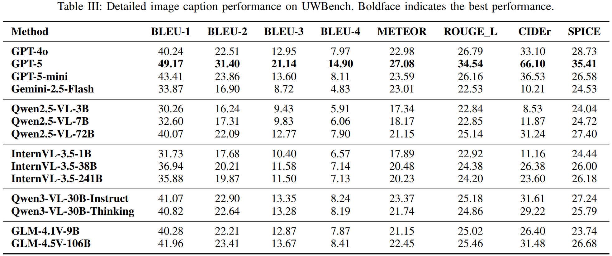
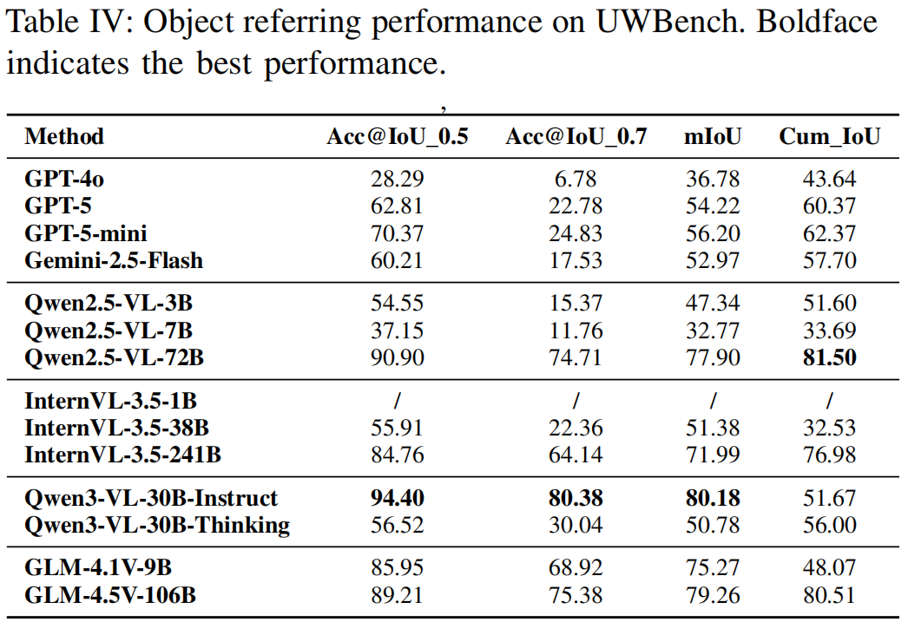
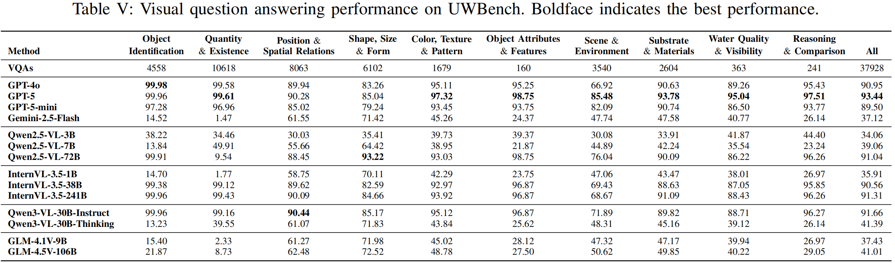
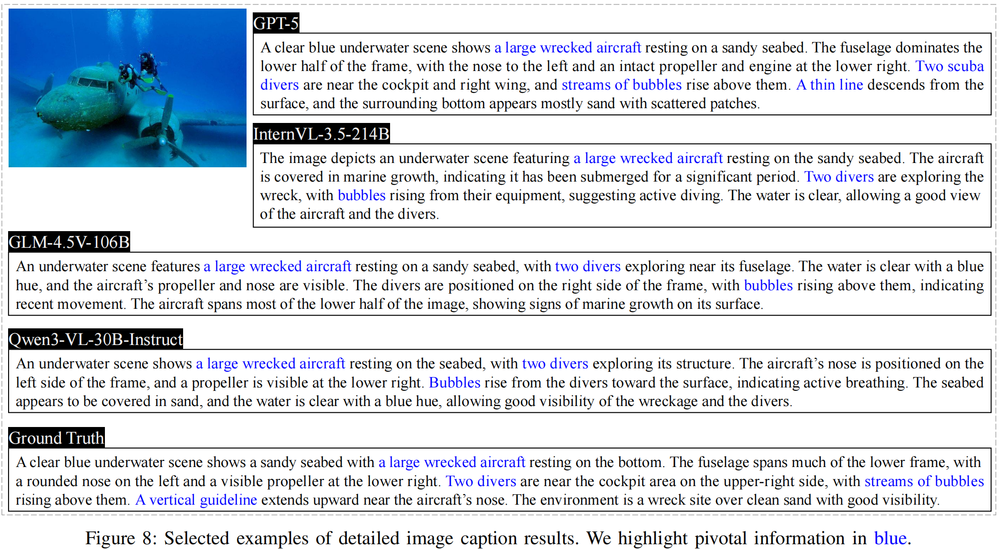
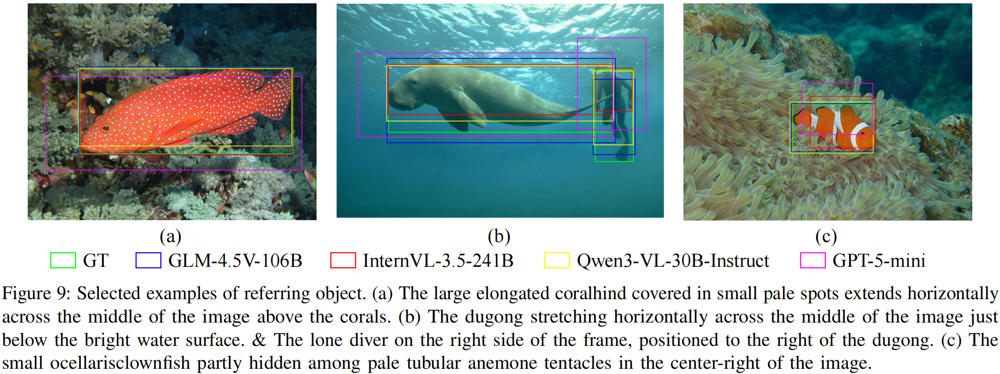
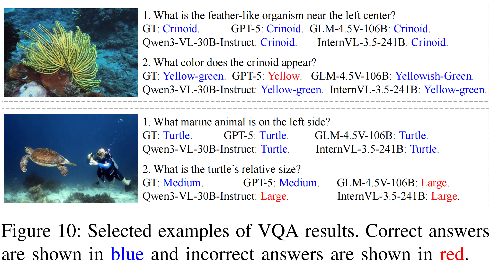

# UWBench: A Comprehensive Vision-Language Benchmark for Underwater Understanding

<p align="center">
    
<p>

<div align="center">
<strong>Author: Xuelong Li<sup>✉</sup>, Da Zhang, Chenggang Rong, Zhiyuan Zhao, Junyu Gao</strong>
  
<strong>Institute of Artificial Intelligence (TeleAI), China Telecom</strong>
</div>

This is the official repository for paper **"UWBench: A Comprehensive Vision-Language Benchmark for Underwater Understanding"**. [[paper](https://arxiv.org/abs/2510.18262)] [[UWBench](https://huggingface.co/datasets/da1018/UWBench)]

<strong>Please share a <font color='orange'>STAR ⭐</font> if this project does help~</strong>

<!-- ### You can focus on remote sensing multimodal large language model (Vision-Language) [here](https://github.com/ZhanYang-nwpu/Awesome-Remote-Sensing-Multimodal-Large-Language-Model)
 ### You can focus on multimodal large language model (Vision-Language) for UAV [here](https://github.com/ZhanYang-nwpu/Awesome-Multimodal-Large-Language-Models-for-UAV-Vision-Language-Perception) -->

## 📢 Latest Updates
This is an ongoing project. We will be working on improving it.
- 📦 All model employments tutorial coming soon! 🚀
- 📄 Training & Inference results of all model will be published! 🚀
<!-- - **May-13-2025**: SkyEyeGPT model checkpoint is released. [[huggingface](https://huggingface.co/ZhanYang-nwpu/SkyEyeGPT)] 🔥🔥 （The Model Weight can be run directly with [MiniGPT-v2](https://github.com/Vision-CAIR/MiniGPT-4)）
- **Jan-19-2025**: SkyEyeGPT paper is accepted by ISPRS. [[paper](https://doi.org/10.1016/j.isprsjprs.2025.01.020)] 🔥🔥  -->
- **Feb-27-2026**: Underwater Understanding Dataset UWBench is released. [[huggingface](https://huggingface.co/datasets/da1018/UWBench)] 🔥🔥
- **Oct-10-2025**: paper is released. 🔥🔥
<!-- - **Jan-17-2024**: A curated list about [remote sensing multimodal large language model (Vision-Language)](https://github.com/ZhanYang-nwpu/Awesome-Remote-Sensing-Multimodal-Large-Language-Model) is created. 🔥🔥 -->


##  UWBench Description

<p align="center">
    
<p>
UWBench is a comprehensive benchmark specifically designed for underwater vision-language understanding. It comprises 15K high-resolution underwater images captured across diverse aquatic environments, encompassing oceans, coral reefs, and deep-sea habitats. Each image is enriched with human-verified annotations including 15,281 object referring expressions that precisely describe marine organisms and underwater structures, and 124,983 question-answer pairs covering diverse reasoning capabilities from object recognition to ecological relationship understanding. The dataset captures rich variations in visibility, lighting conditions, and water turbidity, providing a realistic testbed for model evaluation. 


## 🔨 UWBench Construction

<p align="center">
    
<p>
This pipeline initiates with multi-source underwater image acquisition via web mining, public datasets, and in-situ photography. Subsequent attribute extraction systematically categorizes environmental, taxonomic, and morphological features. Prompt engineering then directs GPT-5 to synthesize comprehensive captions, referring expressions, and visual QA pairs. Finally, a rigorous three-stage validation protocol ensures annotation fidelity, yielding a robust, ecologically representative underwater vision-language dataset.


## 🚀 Training and Inference
We have released V1, which only reports the test results. Our work is still ongoing, and the next version including training details will be coming soon.


## 🌋 UWBench Download
The download link of the UWBench is here! 🚀

Download link: https://huggingface.co/datasets/da1018/UWBench

<div align="center">
  
</div>


## 📦 Performance
**1.Image Captioning**
<div align="center">
  
</div>

**2.Object Referring**
<div align="center">
  
</div>

**3.Visual Question Answering**
<div align="center">
  
</div>


## 👁️ Visualization
**1.Image Captioning**
<div align="center">
  
</div>

**2.Object Referring**
<div align="center">
  
</div>

**3.Visual Question Answering**
<div align="center">
  
</div>


## 📜 Citation
```bibtex
@article{zhang2025uwbench,
  title={UWBench: A Comprehensive Vision-Language Benchmark for Underwater Understanding},
  author={Zhang, Da and Rong, Chenggang and Li, Bingyu and Wang, Feiyu and Zhao, Zhiyuan and Gao, Junyu and Li, Xuelong},
  journal={arXiv preprint arXiv:2510.18262},
  year={2025}
}
```


## 🙏 Acknowledgement
We are thankful to [VRSBench](https://github.com/lx709/VRSBench) and [CLAIR](https://github.com/DavidMChan/clair) for releasing their models and code as open-source contributions.


## 🤖 Contact
If you have any questions about this project, please feel free to contact zhangda1018@126.com.
